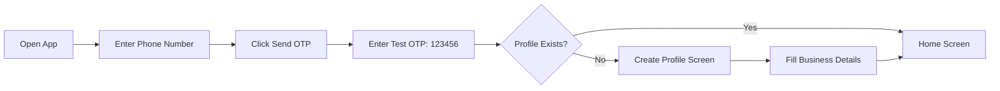

# Testing Guide: How to Test Without Paid SMS Services

## Overview

This guide explains how to test your Can Can Vendor app without paying for SMS/OTP services. Your app already has a built-in **Test Mode** that allows you to bypass real SMS during development.

---

## What Pro Developers Do

Professional developers use these strategies for testing authentication without paying for SMS:

| Strategy | Description | Cost |
|----------|-------------|------|
| **Test Mode / Mock Auth** | Bypass real OTP with hardcoded values | FREE |
| **Supabase Dashboard** | Directly view/modify database data | FREE |
| **Database Logs** | Monitor real-time database activity | FREE |
| **Free SMS Credits** | Use limited free tiers from Twilio/MessageBird | FREE (limited) |
| **Email OTP** | Send OTP via email instead of SMS | FREE |

**Your app already implements Strategy #1 (Test Mode)!**

---

## Quick Start: Enable Test Mode

### Step 1: Edit AuthService

Open [`lib/services/auth_service.dart`](../lib/services/auth_service.dart) and change line 11:

```dart
// Change this:
static const bool _testMode = false;

// To this:
static const bool _testMode = true;  // Enable test mode
```

### Step 2: Hot Reload or Restart

After changing the flag:
- If app is running: Press `r` in terminal for hot reload
- Or restart the app completely

### Step 3: Test Authentication

1. Open the app
2. Enter any 10-digit phone number (e.g., `9876543210`)
3. Click "Send OTP"
4. On OTP screen, enter: `123456`
5. Click "Verify OTP"

**That's it!** No SMS provider needed.

---

## Testing Workflow

### Phase 1: Test Authentication



### Phase 2: Verify Data in Supabase

After creating your vendor profile, verify it was saved:

1. Go to your Supabase Dashboard
2. Click **Table Editor** (grid icon in sidebar)
3. Open the **`vendors`** table
4. You should see your vendor record!

### Phase 3: Add Test Products

Since you don't have a customer app yet, add products via Supabase:

#### Option A: Using SQL Editor (Recommended)

1. Go to **SQL Editor** in Supabase Dashboard
2. Run this query to add products to your inventory:

```sql
-- First, get your vendor_id from the vendors table
SELECT id, phone FROM vendors;

-- Then insert products for your vendor
-- Replace 'your-vendor-id-here' with your actual vendor_id

INSERT INTO vendor_products (vendor_id, product_id, selling_price, deposit_amount, current_stock, low_stock_threshold)
SELECT 
    'your-vendor-id-here'::uuid,
    p.id,
    70.00,  -- 20L price
    0.00,   -- deposit
    50,     -- stock
    10      -- low stock threshold
FROM products p
WHERE p.name = '20L Water Can';

INSERT INTO vendor_products (vendor_id, product_id, selling_price, deposit_amount, current_stock, low_stock_threshold)
SELECT 
    'your-vendor-id-here'::uuid,
    p.id,
    40.00,  -- 10L price
    0.00,
    50,
    10
FROM products p
WHERE p.name = '10L Water Can';

INSERT INTO vendor_products (vendor_id, product_id, selling_price, deposit_amount, current_stock, low_stock_threshold)
SELECT 
    'your-vendor-id-here'::uuid,
    p.id,
    25.00,  -- 5L price
    0.00,
    50,
    10
FROM products p
WHERE p.name = '5L Water Can';
```

#### Option B: Using Table Editor

1. Open **`vendor_products`** table
2. Click "Insert row"
3. Fill in the fields:
   - `vendor_id`: Copy from your vendor record
   - `product_id`: Copy from products table
   - `selling_price`: e.g., 70.00
   - `deposit_amount`: 0
   - `current_stock`: 50
   - `low_stock_threshold`: 10

### Phase 4: Create Test Orders

Create test orders to verify the app displays them correctly:

```sql
-- Get your vendor_id and customer_id first
SELECT id, name FROM vendors;
SELECT id, name FROM customers;

-- Insert a test customer (if needed)
INSERT INTO customers (name, phone, address, flat_number, floor, building_name)
VALUES ('Test Customer', '+919876543210', '123 Test Street, Mumbai', 'A-101', '1', 'Test Building');

-- Insert a test order
-- Replace vendor_id and customer_id with actual values
INSERT INTO orders (order_number, vendor_id, customer_id, delivery_date, time_slot, total_amount, status, payment_status)
VALUES (
    (SELECT '#' || COALESCE(CAST(MAX(CAST(SUBSTRING(order_number FROM 2) AS INTEGER)) + 1 AS TEXT), '1001') FROM orders),
    'your-vendor-id-here'::uuid,
    (SELECT id FROM customers WHERE phone = '+919876543210' LIMIT 1),
    CURRENT_DATE,
    '8:00 AM - 10:00 AM',
    140.00,
    'pending',
    'unpaid'
);

-- Insert order items
INSERT INTO order_items (order_id, product_id, quantity, unit_price, subtotal)
SELECT 
    (SELECT id FROM orders ORDER BY created_at DESC LIMIT 1),
    p.id,
    2,      -- quantity
    70.00,  -- unit price
    140.00  -- subtotal
FROM products p
WHERE p.name = '20L Water Can';
```

### Phase 5: Verify in App

1. Open the app (or hot reload)
2. Go to **Home** tab - you should see today's orders
3. Go to **History** tab - you should see all orders
4. Go to **Inventory** tab - you should see your products with stock

---

## Monitoring Database Changes

### Real-time Database Logs

1. Go to Supabase Dashboard
2. Click **Database** → **Logs** (in sidebar)
3. Watch for real-time queries as you use the app

### Using Table Editor

1. Keep Table Editor open in a browser tab
2. After making changes in the app:
   - Click the **Refresh** button (↻)
   - You'll see new/updated records

### Using SQL Editor for Quick Checks

```sql
-- Check if vendor profile exists
SELECT * FROM vendors WHERE phone = '+91YOUR_PHONE';

-- Check today's orders
SELECT o.*, c.name as customer_name
FROM orders o
JOIN customers c ON o.customer_id = c.id
WHERE o.delivery_date = CURRENT_DATE;

-- Check inventory
SELECT vp.*, p.name as product_name
FROM vendor_products vp
JOIN products p ON vp.product_id = p.id
WHERE vp.vendor_id = 'your-vendor-id';
```

---

## Common Testing Scenarios

### Scenario 1: Test Login Flow

| Step | Action | Expected Result |
|------|--------|----------------|
| 1 | Open app | Login screen appears |
| 2 | Enter phone: `9876543210` | Phone accepted |
| 3 | Click "Send OTP" | Navigate to OTP screen |
| 4 | Enter OTP: `123456` | Login successful |
| 5 | If new user | Profile setup screen |
| 6 | If existing user | Home screen |

### Scenario 2: Test Profile Creation

| Step | Action | Expected Result |
|------|--------|----------------|
| 1 | Fill profile form | All fields validated |
| 2 | Click "Create Profile" | Navigate to Home |
| 3 | Check Supabase | New vendor record in `vendors` table |

### Scenario 3: Test Inventory Display

| Step | Action | Expected Result |
|------|--------|----------------|
| 1 | Add products to `vendor_products` | Via SQL or Table Editor |
| 2 | Open app → Inventory tab | Products displayed with stock |
| 3 | Check stock status | Color-coded (low stock warning) |

### Scenario 4: Test Order Display

| Step | Action | Expected Result |
|------|--------|----------------|
| 1 | Create order in Supabase | Via SQL or Table Editor |
| 2 | Open app → Home tab | Today's orders shown |
| 3 | Open app → History tab | All orders shown |
| 4 | Click order | Order details modal |

---

## Troubleshooting

### Issue: "Invalid OTP" even with 123456

**Solution:** Make sure test mode is enabled:
```dart
// In lib/services/auth_service.dart
static const bool _testMode = true;  // Must be true
```

### Issue: Data not appearing in Supabase

**Solutions:**
1. Check `.env` file has correct credentials
2. Verify RLS policies allow inserts
3. Check Supabase logs for errors
4. Try hot reload or restart app

### Issue: Orders not showing in app

**Solutions:**
1. Verify `vendor_id` in orders matches your auth user ID
2. Check `delivery_date` format is YYYY-MM-DD
3. Ensure status is 'pending' for Home tab
4. Refresh app or hot reload

### Issue: "Permission denied" errors

**Solutions:**
1. Verify you're logged in (test mode creates session)
2. Check RLS policies in Supabase
3. Ensure vendor_id matches auth.uid()

---

## Production Checklist

Before going live with real customers:

- [ ] Set `_testMode = false` in [`auth_service.dart`](../lib/services/auth_service.dart)
- [ ] Configure real SMS provider (Twilio/MessageBird)
- [ ] Test with real phone numbers
- [ ] Verify RLS policies are active
- [ ] Remove all test data from database
- [ ] Test full flow: login → profile → order → delivery → payment
- [ ] Test on real devices, not just emulator

---

## Free SMS Options (If You Need Real OTP Later)

### Twilio Free Tier

1. Sign up at https://www.twilio.com
2. Get free trial credits (~$15)
3. Configure in Supabase:
   - Go to Authentication → Providers → Phone
   - Select Twilio
   - Enter Account SID, Auth Token, Phone Number

### MessageBird Free Trial

1. Sign up at https://www.bird.com
2. Get free credits (~€10)
3. Configure in Supabase similar to Twilio

---

## Summary

| What You Need | How to Do It |
|---------------|--------------|
| **Test without SMS** | Enable `_testMode = true`, use OTP `123456` |
| **Verify data saved** | Check Supabase Table Editor |
| **Monitor changes** | Use Database Logs or refresh Table Editor |
| **Add test data** | Use SQL Editor or Table Editor |
| **Test full flow** | Create orders manually in Supabase |

---

## Next Steps

1. Enable test mode in [`lib/services/auth_service.dart`](../lib/services/auth_service.dart)
2. Run the app and test authentication
3. Verify vendor profile appears in Supabase
4. Add test products via SQL Editor
5. Create test orders
6. Verify everything appears in the app

**Remember:** Test mode is for development only. Disable it before production!
