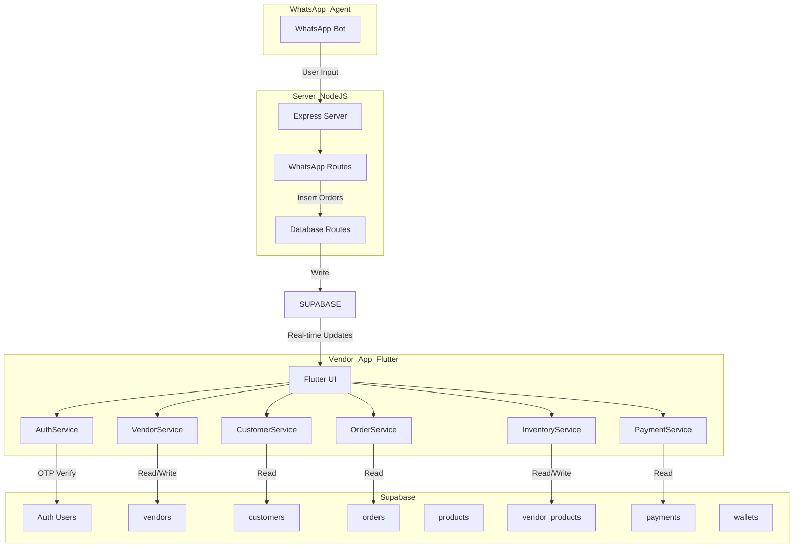
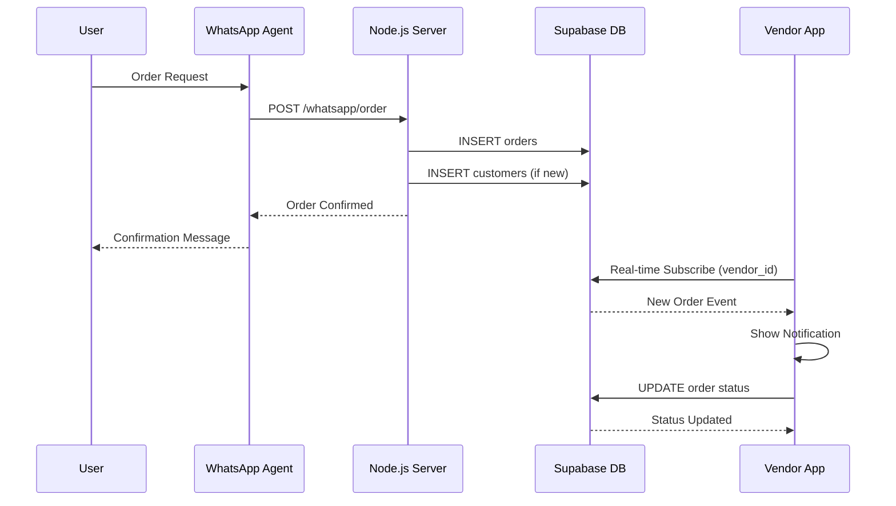
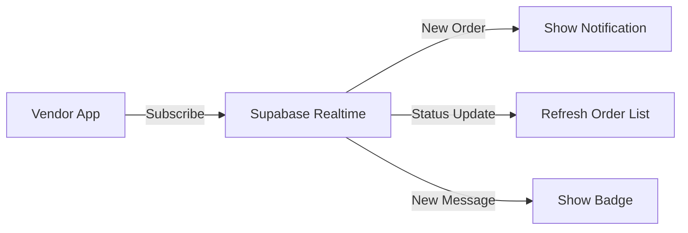
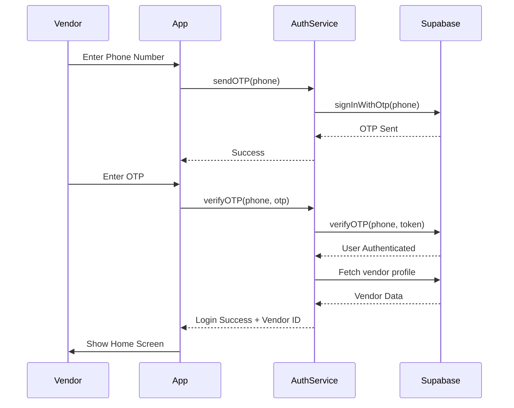

# Vendor App Improvements Plan

## Overview

This plan addresses three main areas:
1. **Navigation Fix** - Persistent bottom navigation across all screens
2. **Full Supabase Integration** - Complete database connectivity
3. **Settings Page Completion** - Implement all settings features

---

## Database Architecture

### Design Decision: Single Tables with vendor_id

**Answer to user's question: Should we have separate tables for each vendor?**

**NO** - We should NOT have separate tables per vendor. The existing schema design with a single `orders` table that includes `vendor_id` is the correct approach.

### Why Single Tables Are Better:

1. **Scalability** - Adding new vendors requires no schema changes
2. **Data Integrity** - Foreign keys maintain referential integrity
3. **Query Efficiency** - Indexes on `vendor_id` enable fast filtering
4. **Cross-Vendor Analytics** - Easy to compare vendor performance
5. **Maintenance** - Single schema is easier to maintain and backup

### Required Tables (Already Defined in unified_schema.sql):

| Table | Purpose | Key Fields |
|--------|---------|-------------|
| `vendors` | Vendor profiles | id, business_name, phone, location, is_active |
| `customers` | Customer profiles | id, vendor_id, name, phone, address |
| `orders` | All orders | id, vendor_id, customer_id, status, total_amount |
| `order_items` | Individual order items | id, order_id, product_id, quantity |
| `products` | Product catalog | id, name, category, base_price |
| `vendor_products` | Vendor-specific pricing | id, vendor_id, product_id, price, stock |
| `payments` | Payment records | id, order_id, vendor_id, amount, status |
| `vendor_wallets` | Wallet balances | id, vendor_id, balance, pending_balance |
| `wallet_transactions` | Transaction history | id, vendor_id, type, amount |

---

## System Architecture



---

## Data Flow



---

## Implementation Plan

### Phase 1: Navigation Refactoring

**Goal:** Persistent bottom navigation bar with 5 tabs

**Changes Required:**

1. **Update HomeScreenEnhanced** - Add 5th tab for Settings
   - Current tabs: Home, History, Payments, Inventory
   - Add: Settings as 5th tab

2. **Create BaseScreenWidget** - Wrapper for all tab screens
   - Ensures bottom navigation is always visible
   - Handles back button behavior

3. **Update SettingsScreen** - Remove drawer, add back button
   - Settings accessed from bottom nav, not drawer
   - Back button returns to previous tab

### Phase 2: Supabase Services Implementation

**Goal:** Complete Supabase integration for all data operations

#### Services to Create/Update:

1. **VendorService** (`android/lib/services/vendor_service.dart`)
   - `getVendorProfile()` - Fetch current vendor from Supabase
   - `updateVendorProfile()` - Update vendor details
   - `updateBusinessHours()` - Update operating hours
   - `toggleVacationMode()` - Enable/disable vacation

2. **OrderService** (`android/lib/services/order_service.dart`)
   - `getTodayOrders(status)` - Fetch today's orders by status
   - `getOrderById(id)` - Fetch single order
   - `updateOrderStatus(id, status)` - Update order status
   - `getOrderHistory(filters)` - Fetch order history
   - `subscribeToOrders()` - Real-time order updates

3. **CustomerService** (`android/lib/services/customer_service.dart`)
   - `getAllCustomers()` - Fetch all customers
   - `getCustomerById(id)` - Fetch single customer
   - `searchCustomers(query)` - Search customers
   - `getCustomerInsights()` - Analytics data

4. **InventoryService** (`android/lib/services/inventory_service.dart`)
   - `getVendorProducts()` - Fetch vendor's products
   - `updateStock(productId, quantity)` - Update inventory
   - `getLowStockItems()` - Alert for low stock

5. **PaymentService** (`android/lib/services/payment_service.dart`)
   - `getPaymentHistory()` - Fetch payment records
   - `getWalletBalance()` - Fetch wallet balance
   - `getWalletTransactions()` - Transaction history

### Phase 3: Settings Screen Completion

**Goal:** Implement all settings functionality

**Settings Sections:**

1. **Profile Settings** (Already implemented)
   - Name, Business Name, Address
   - Save functionality

2. **Business Hours** (Already exists, needs Supabase sync)
   - Opening/closing times per day
   - Save to Supabase

3. **Notifications** (Already exists, needs Supabase sync)
   - Push notification preferences
   - Order update notifications

4. **Vacation Mode** (Already exists, needs Supabase sync)
   - Enable/disable vacation
   - Auto-reply message

5. **Account Settings** (To implement)
   - Change password
   - Delete account
   - Privacy settings

### Phase 4: Real-time Updates

**Goal:** Live order updates via Supabase Realtime



Implementation:
- Use Supabase `.on()` for real-time subscriptions
- Subscribe to `orders` table filtered by `vendor_id`
- Handle INSERT events (new orders)
- Handle UPDATE events (status changes)

---

## File Structure Changes

### New/Modified Files:

```
android/lib/
├── config/
│   └── supabase_config.dart (Update for production)
├── services/
│   ├── vendor_service.dart (Update for Supabase)
│   ├── order_service.dart (Update for Supabase)
│   ├── customer_service.dart (Update for Supabase)
│   ├── inventory_service.dart (Update for Supabase)
│   └── payment_service.dart (Create/Update)
├── screens/
│   ├── home/
│   │   └── home_tab_screen_enhanced.dart (Add 5th tab)
│   └── settings/
│       └── settings_screen.dart (Complete implementation)
└── widgets/
    └── base_screen.dart (Create for persistent nav)
```

---

## Authentication Flow



---

## Testing Checklist

- [ ] Vendor can login with OTP
- [ ] Vendor sees only their orders (filtered by vendor_id)
- [ ] Vendor sees only their customers (filtered by vendor_id)
- [ ] Real-time order updates work
- [ ] Bottom navigation persists across all screens
- [ ] Settings changes save to Supabase
- [ ] Vacation mode toggles correctly
- [ ] Business hours update correctly
- [ ] Payment history loads correctly
- [ ] Inventory updates reflect in Supabase
- [ ] Logout clears session properly

---

## Key Decisions Summary

| Decision | Choice | Rationale |
|-----------|---------|------------|
| Database Design | Single tables with vendor_id | Scalable, maintainable |
| Navigation | 5-tab bottom bar | Persistent access to all features |
| Data Access | Direct Supabase queries | Faster, real-time capable |
| Auth Flow | Phone OTP via Supabase | Secure, no password management |
| Real-time | Supabase Realtime SDK | Built-in, reliable |
